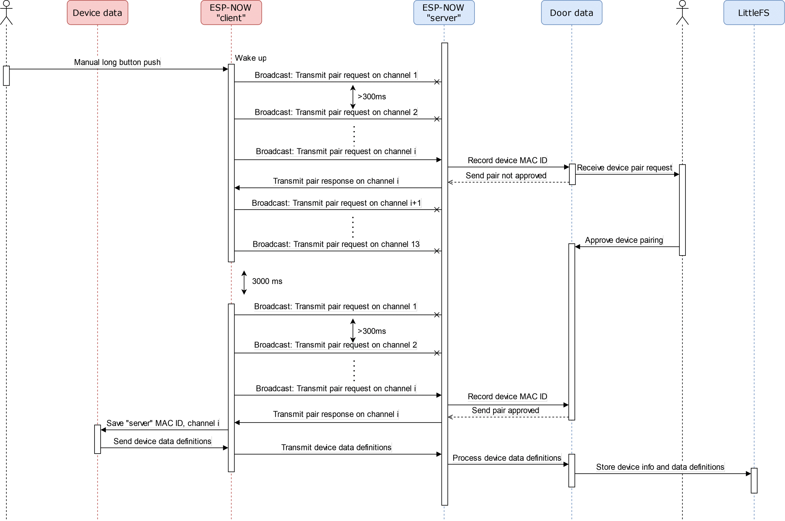
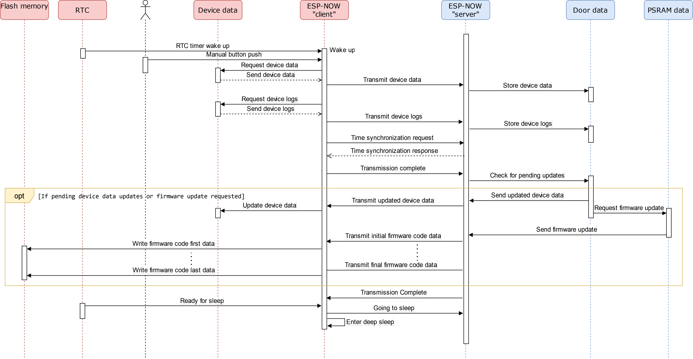
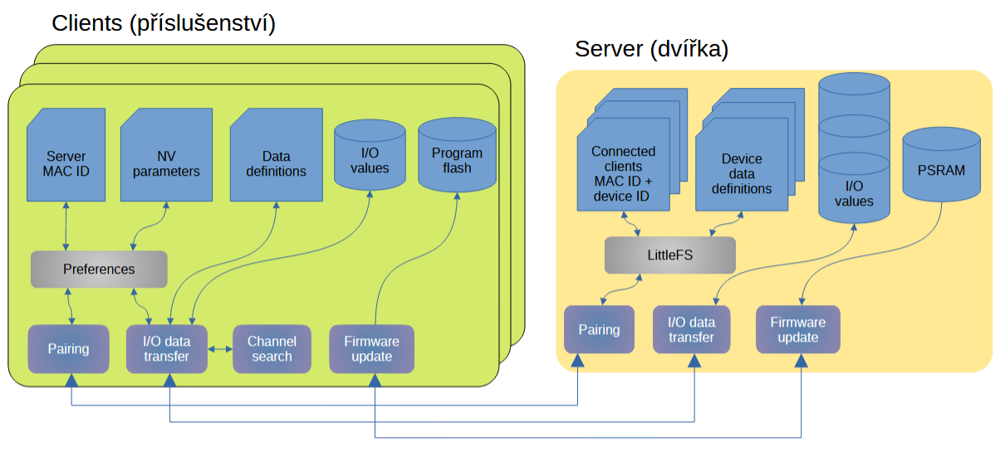
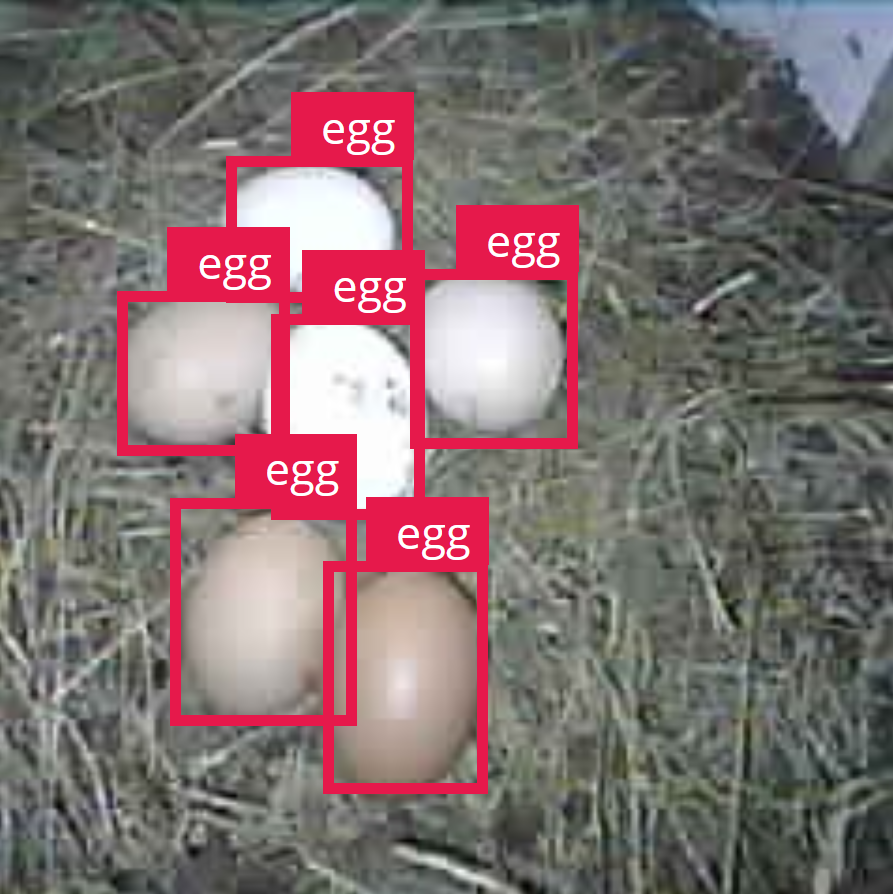
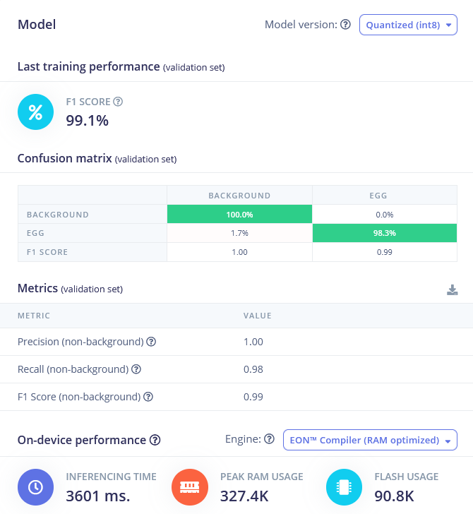
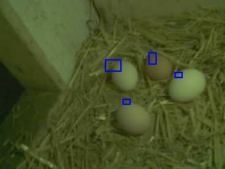

# ESP32: Detekce objektů v obraze pomocí metod AI - detekce a počítání vajec

> **Poznámka:** Tento projekt obsahuje *pouze firmware* pro kamerový modul,  
> který slouží jako příslušenství pro **automatický systém pro domácí chov slepic**.  
> Webové rozhraní a firmware hlavní řídicí jednotky (dvířek) jsou v samostatném  
> [repozitáři dvířek](https://github.com/pavelkejik/chicken-door).

---

Tento doplňkový modul rozšiřuje funkce *Chytrých kurníkových dvířek* o možnost automatické detekce a počítání vajec ve snášedle. Zařízení využívá ESP32-CAM nebo ESP-EYE, umělou inteligenci natrénovanou pomocí Edge Impulse a bezdrátově komunikuje s dvířky prostřednictvím nízkoenergetického protokolu ESP-NOW.

Funguje zcela autonomně – pořizuje snímky, detekuje počet vajec, odesílá výsledky, a následně se přepíná do úsporného režimu. Celý systém funguje zcela bez připojení k Wi-Fi síti a bez nutnosti zásahu uživatele.

---

## Použité technologie a architektura

| Komponenta          | Technologie / Funkce                                                                 |
|---------------------|----------------------------------------------------------------------------------------|
| **HW platforma**     | ESP32-CAM nebo ESP-EYE (doporučeno s PSRAM ≥ 4 MB), volitelně LED blesk              |
| **Firmware**         | Arduino-ESP32 (PlatformIO), více FreeRTOS tasků (`cameraTask`, `espnowTask`, ...)    |
| **AI model**         | FOMO MobileNetV2 0.35 – kvantizovaný model z Edge Impulse SDK (8bit, grayscale)       |
| **Komunikace**       | ESP-NOW – bezdrátový přenos dat, logů, parametrů i OTA aktualizací                    |
| **Datové formáty**   | JSON (`ArduinoJson`) – parametry, logy; JPEG – obraz se zakreslenými detekcemi       |
| **Použité knihovny** | `esp32-camera`, `ArduinoJson`, `lib/Egg-counter_inferencing` – vygenerovaná knihovna z Edge Impulse  |

### Hlavní části firmwaru (FreeRTOS tasky)

Firmware je rozdělen do několika paralelních úloh (tasků) běžících pod FreeRTOS. Každý task má definovanou odpovědnost:

| Task           | Funkce                                                                 |
|----------------|------------------------------------------------------------------------|
| `cameraTask`   | Pořízení snímku, převod na 180×180 greyscale, inference AI modelu, vyznačení detekcí |
| `espnowTask`   | Odesílání parametrů, obrázků a logů přes ESP-NOW; příjem příkazů a synchronizace času |
| `loggerTask`   | Ukládání logů do fronty, odeslání přes ESP-NOW, zápis do souboru v souborovém systému LittleFS         |
| `sleepTask`    | Řízení hlubokého spánku – uspání zařízení po dokončení všech přenosů a úkolů |

---

## Struktura projektu

```text
cam-egg-counter/
├─ src/                # Hlavní firmware – Arduino (C++)
├─ lib/                # AI model (Edge Impulse – egg counter)
├─ data/               # Zde lze vložit soubory pro LittleFS (zatím nevyužito)
├─ doc/                # Dokumentace
│   ├─ img/            # Ilustrační obrázky (AI výstupy, diagramy…)
│   ├─ doc.md          # Zdrojová verze dokumentace
│   └─ doc.pdf         # Dokumentace ve formátu PDF
└─ platformio.ini      # Nastavení buildu PlatformIO
```

---

## ESP-NOW – párování, konfigurace a komunikační cyklus

Kamerový modul komunikuje s hlavní jednotkou (dvířky) **bez nutnosti Wi-Fi sítě**, prostřednictvím protokolu **ESP-NOW**. Celý proces probíhá ve třech hlavních fázích:

### Párování zařízení

Párování se spouští automaticky, pokud zařízení zatím není spárovano. Kamera začne vysílat žádost o párování, kterou dvířka zachytí a nabídnou k autorizaci ve webovém rozhraní.  
Po schválení si dvířka uloží:

* MAC adresu zařízení (pro identifikaci při dalších spojeních),
* a všechny **definice parametrů**, které modul podporuje (datový typ, minimální a maximální hodnoty,...).

### Periodický komunikační cyklus

Zařízení se typicky každých 10 sekund probudí (interval komunikace lze konfigurovat z webového rozhraní), pořídí a analyzuje snímek a odešle aktuální data. Cyklus zahrnuje:

1. Odeslání parametrů a anotovaného snímku pomocí ESP-NOW.
2. Přijetí odpovědi (ACK, synchronizace času, případné nové nastavení parametrů).
3. Přechod zpět do hlubokého spánku pro úsporu energie.

### Dálková změna konfigurace

Jakékoli parametry zařízení lze měnit vzdáleně pomocí webového rozhraní (např. automatické snímaní během dne, aktivace blesku, …).  
Dvířka novou hodnotu odešlou kameře automaticky při nejbližší komunikaci.

---

### Schémata komunikace

  
*Obr. 1 – Sekvence párování zařízení s dvířky*

  
*Obr. 2 – Pravidelný cyklus: probuzení → odeslání → odpověď → uspání*

  
*Obr. 3 – Architektura datové výměny mezi příslušenstvím a dvířky. Vlevo klient (kamera), vpravo centrální jednotka (dvířka). Každý modul má vlastní úložiště parametrů, definic a logiky pro přenos a aktualizace.*

---

## Trénování a nasazení AI modelu (Edge Impulse)

**Model:** FOMO MobileNetV2 0.35  
**Platforma:** [Edge Impulse Studio](https://studio.edgeimpulse.com/)

Pro detekci vajec byl použit objektový detekční model typu FOMO (Faster Objects, More Objects), natrénovaný a kvantizovaný přímo v Edge Impulse.  

* Nasbíráno celkem **~1300 snímků** z reálného prostředí kurníku  
  – z toho cca **200 negativních vzorků** (prázdné snášedlo bez vajec).
* **Ručně anotováno**: každý snímek obsahuje bounding box pro každé vejce.


<p><em>Obr. 4 – Ukázka ruční anotace dat v Edge Impulse.</em></p>


* Rozdělení datasetu: **80 % pro trénink**, **20 % pro testování**.
* **Vstupní rozlišení:** 180×180 px, ve stupních šedi (*greyscale*).  
  * Nižší rozlišení vedlo ke splývání objektů (více vajec detekováno jako jedno),
  * vyšší rozlišení způsobovalo problémy s RAM a překračovalo **časový limit (1 h)** trénování ve free verzi Edge Impulse.
* **Hyperparametry:**  
  * 100 epoch  
  * learning rate: 0.001  
  * aktivováno **data augmentation** (otáčení, změna jasu atd.)
* **Výsledky na validační sadě:**  
  * F1-score: ~99 %  
  * Precision: 100 %  
  * Recall: 98 %

> Model byl kvantizován (8bit) a nasazen přímo do ESP32 pomocí Edge Impulse SDK.  
> **Inference trvá přibližně 3–4 sekundy** a probíhá zcela offline na mikrokontroléru.


<p><em>Obr. 5 – Výsledky tréninku modelu v Edge Impulse (precision, recall, ...)</em></p>


---

## Ukázka výstupu AI inference

Po zpracování snímku modelem proběhne jednoduchý post-processing, kde firmware:

* spočítá **počet detekovaných vajec**,
* vykreslí **barevné obdélníky** (bounding boxy) do původního snímku

Každá detekce musí překročit předem definovanou **pravděpodobnostní mez (threshold)**, která je nastavena na **0.6** (nastavitelné v kódu) – tj. pouze objekty, u kterých model vyhodnotí pravděpodobnost detekce vajíčka ≥ 60 %, jsou započítány.

Tento anotovaný JPEG se poté odešle přes ESP-NOW do hlavní jednotky (*dvířek*), kde se dále zpracuje nebo zobrazí ve webovém rozhraní.


*Obr. 6 – Příklad snímku se čtyřmi vajíčky, které model rozpoznal a označil modrými rámečky.*

---

## Webové rozhraní (na dvířkách)

Veškeré data a možnosti ovládání jsou na webu hostovaném dvířky:

* Aktuální snímek s detekcí
* Graf historie počtu vajec
* Přehled a editace parametrů příslušenství
* Zobrazení posledních logů
* Možnost OTA aktualizace FW kamery

---

## Zkušenosti z provozu: výhody a limity

### Výhody

* **Autonomní provoz bez Wi-Fi** – komunikace přes ESP-NOW, bez závislosti na síti nebo cloudu.
* **Nízká spotřeba energie** – zařízení většinu času spí, vhodné pro bateriové napájení.
* **Bezúdržbové přidávání parametrů** – dvířka přijímají definice z příslušenství, není třeba aktualizovat jejich firmware.
* **Bezdrátová OTA aktualizace přes dvířka.**
* **Inference přímo na kameře (edge AI)** – žádný přenos snímků a výpočet na cloudu, vše běží lokálně.

### Omezení a poznatky z testování

* **Citlivost na prostředí** – model byl trénován na konkrétní snášedlo; jiné prostředí nebo světlo mohou zhoršit přesnost - nutnost rozšíření datasetu.
* **Falešná 0 při zakrytí** – slepice může dočasně zakrýt vejce - model vrátí „0“.
  Možné řešení: detekce slepice, nebo softwarová logika - dočasně ignorovat výrazný pokles počtu detekcí (např. z 4 na 0), pokud je následovaný opětovným nárůstem.
* **Rychlost zpracování** – inference trvá cca 3–4 sekundy; pro tuto úlohu to však není omezující.

---

## Nahrání firmware do zařízení

Nejjednodušší způsob je pomocí **VS Code s rozšířením PlatformIO**:

1. Otevři složku projektu ve VS Code.
2. V PlatformIO postranním panelu klikni na tlačítko **Upload**.
   PlatformIO automaticky přeloží a nahraje firmware na připojené ESP32 zařízení.
3. Pro kontrolu výstupu lze otevřít **Serial Monitor** (`PlatformIO: Monitor`).

Alternativně lze firmware nahrát i přes **Arduino IDE**, ale vyžaduje to ruční přidání knihoven
(`esp32-camera`, `ArduinoJson`) a úpravu cesty k Edge Impulse knihovně (`lib/Egg-counter_...`).

---

## Další zdroje a odkazy

* [Chytrá kurníková dvířka – hlavní projekt](https://github.com/pavelkejik/chicken-door)
* [Edge Impulse dokumentace](https://docs.edgeimpulse.com/)
* [ArduinoJson](https://arduinojson.org/)
* [ESP32-camera](https://github.com/espressif/esp32-camera)

---

**Autor: Pavel Kejík, 2025**
Projekt vznikl jako příslušenství k systému [Chytrá kurníková dvířka](https://github.com/pavelkejik/chicken-door).
Teoretické pozadí a návrh celého systému je detailně popsán v [bakalářské práci](https://theses.cz/id/ta2i5b/xkejik06_bakalarska_prace.pdf).
